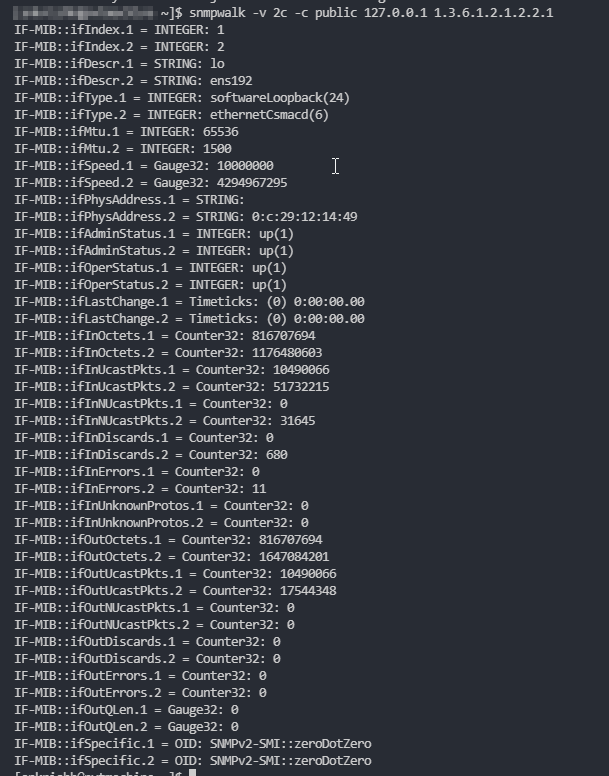
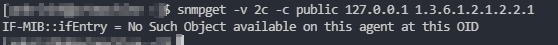
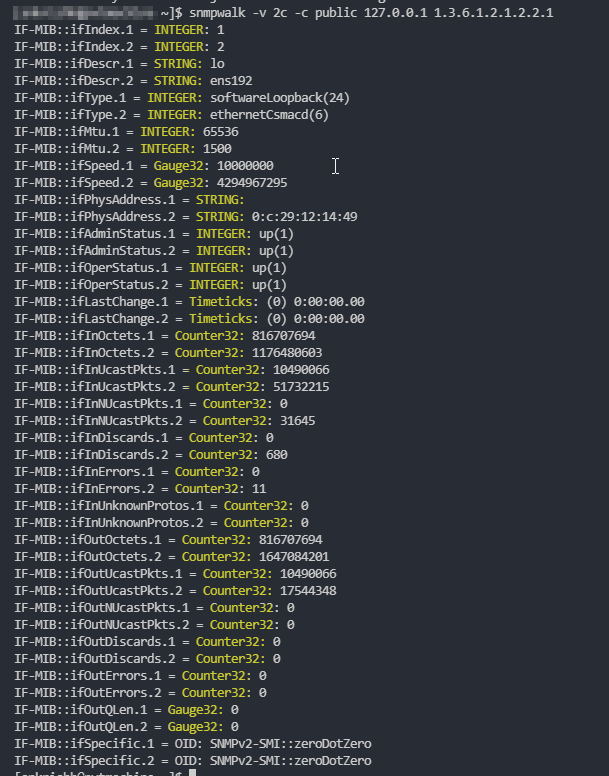

# Gather SNMP OIDs for extension

Dynatrace Extension 2.0 SNMP framework requires that you provide the exact OIDs (Object Identifiers) you wish to monitor. This approach is different to other common SNMP managers where you can present an entire MIB file. 

### Terminology:

**OID (Object Identifier)**

An OID is a sequence of digits separated by '.' that refers to a particular metric on the device. 

For example, the OID `1.3.6.1.2.1.1.3.0` refers to `sysUpTime` which provides the up time of the device in TimeTicks.

**MIB (Management Information Base)**:

A MIB is a file that device manufacturer provides that contains the OIDs accepted by a device. A device usually has multiple MIBs focussing on certain set of metrics. For example, a MIB with OIDs for resource metrics like CPU, Memory etc, another for interface metrics and so on.

There are 2 types of MIBs:
- Generic MIBs that are common to all devices irrespective of make and model.
- Device specific MIBs that provide device specific metrics.

All MIBs accepted by a device are usually available to download from device management UI. If not, it will be on the manufacturer website.

 

### Reading MIB files

MIB files usually come in `.txt` or `.mib` formats but can also depend on the manufacturer. The common factor is that all MIBs should be readable in a text editor.

The MIB files usually provide OIDs in string format. In order to get the numeric format you may have to use a MIB browser software. 

iReasoning is an example for a popular MIB browser. Please visit [iReasoning Website](http://www.ireasoning.com/) for details.

 

### Gathering required OIDs

Once you have all the relevant MIB files, its time to gather OIDs.

I would recommending writing down a list of metrics that are critical to monitor, for your device, on a piece of paper before you begin. MIB files can contain thousands of OIDs in it and you can easily get lost looking though it - I have found writing down critical metrics helps maintain focus.

There are broadly two types of OIDs:

1. OIDs that return single values.
2. OIDs that return a table. 

**OIDs that provide single value**

These are the OIDs that provide a single return value - like UpTime, CPU, Memory etc. These metric should be retrivable using a `snmpget` command.

Example:

 `snmpget -v 2c -c public 127.0.0.1 1.3.6.1.2.1.1.3.0` 

This particular query returns the UpTime of a device.

Breaking down the query:

`snmpget`: snmp command to gather a metric

`-v 2c`: Mentions we are using SNMP authenticaion version 2c

`-c public`: Community string for authenticaion

`127.0.0.1`: IP address of device

`1.3.6.1.2.1.1.3.0`: OID to gather details

**OIDs that return a table**

These are the OIDs that return a table of data when queried. An example for this OID is the interface root OID `1.3.6.1.2.1.2.2.1`. These metrics are retrievable using `snmwalk` command.

Example:

`snmpwalk -v 2c -c public 127.0.0.1 1.3.6.1.2.1.2.2.1`

This particular query returns values like Index, Description, Type, MTU, Speed, InOctets, OutOctets etc for each interface on a device. If the device has 2 interfaces, each metric will be returned for both interfaces, but if the devices has 20 interfaces, each metric will be returned for all of the 20 interfaces and so on. The table size (values returned) depends on characteristics of the device.

An `snmpget` on this oid will not return an error message.

Device MIB documentation is the best way to identify if an OID returns a single value or a table.

 

### OID details to note down during research

1. OID in number format. Eg: `1.3.6.1.2.1.1.3.0`
2. Where the OID is returns a single value or a table
3. The return variable type for each metric
   
    Some common variable types seen are:
      - Counter32
      - Counter64   
      - INTEGER
      - Gauge32
      - Gauge64
      - STRING  
      - Timeticks

    This can be seen in the result of an `snmpget` or `snmwalk` command. See highlighted in below result.

    

 

### NEXT: [Prepare extension YAML](2_Prepare_extension_file.md)

