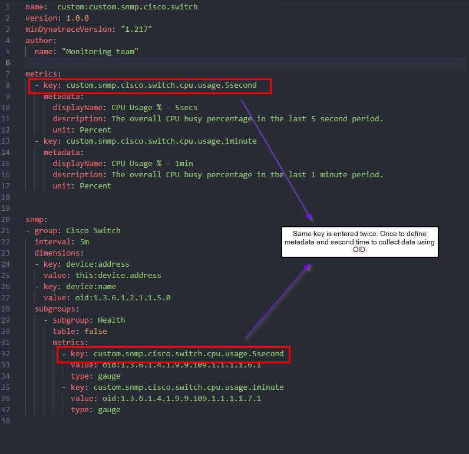
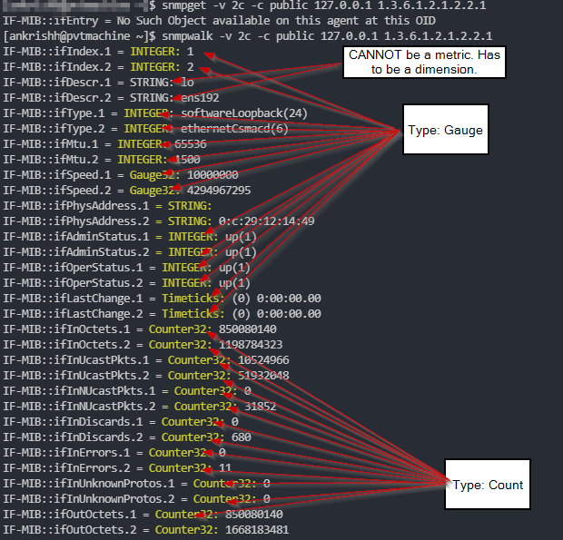

# Prepare extension.yaml

Dynatrace Extension Framework 2.0 provides the capability to define extension configuration as `.yaml` file. In this page, you will learn how to prepare `extension.yaml` file for SNMP monitoring.

> Please read official [Extensions 2.0 concepts](https://www.dynatrace.com/support/help/shortlink/extensions-concepts) for how the extension works.

> This documentation does not require a deep understanding of `yaml` file structure but recommend light reading on the topic.

<br/>

### Extension folder structure

Please structure your extension working directory as below (required):

```
SNMP
 |
 --> Cisco                      # OK to rename with your device name
        |
        --extension             # DO NOT rename
             |
             -- extension.yaml  # DO NOT rename

```

<br/>

## YAML file

The `extension.yaml` file follows below basic structure:


```
name: <value>               
version: <value>
minDynatraceVersion: <value>
author:
  name: <value>

metrics:
- key: <value>
   metadata:
      displayName: <value>
      description: <value>
      unit: <value>
- key: <value>
   metadata:
      displayName: <value>
      description: <value>
      unit: <value>

snmp:
- group: <value>
  interval: <value>
  
  dimensions:
  - key: <value>
    value: <value>

  subgroups:
    - subgroup: <value>
      table: false    
      metrics:
        - key: <value>
          value: oid:<value>
          type: <value>
    - subgroup: <value>
      table: true
      dimensions:
        - key: <value>
          value: <value>
      metrics:
        - key: <value>
          value: oid:<value>
          type: <value>

```

Each parameter in order shown above:

`name`: A name for the extension. This have to be in the format `custom:<your_chosen_name>`. Example: `custom:cisco_router_snmp`

`version`: This is the your extension iteration version. Example: `1.0.0` and go up as `1.1.0`, `1.2.0` and so on as your update the extension.

`minDynatraceVersion`: Earliest version of Dynatrace that this extension can run on. For the purpose of this documentation please use `"1.217"`

<br/>

`author`

  `name`: Company/your name.

<br/>

`metrics`: In this section you define metadata like name, description, unit for your metrics. 

  `key`: This is a unique identifier for your metric. Example: `custom.cisco.switch.cpu.usage.5second`. Please see [Metric key](https://www.dynatrace.com/support/help/shortlink/metric-ingestion-protocol#metric-key-required) for format restrictions.

  `name`: A friendly name for your metric. Example "CPU Usage % - 5secs"

  `description`: A description for your metric

  `unit`: Unit for your metric. Example Percentage, Byte, Count etc. See full list of available units see `Unit` parameter under [Response body > Response parameters (tab) > The MetricDescriptor object > unit > the element can hold these values](https://www.dynatrace.com/support/help/shortlink/api-metrics-v2-get-all#response)

<br/>

`snmp`: In this section all required metrics are organized in groups and subgroups. The recommendation is to keep indivual and table OIDs in separate groups.

`group`: A group of metrics. Please see [Groups and subgroups](https://www.dynatrace.com/support/help/shortlink/extension-yaml#groups-and-subgroups) for details.

`interval`: Frequecy of SNMP polling. Examples: 1m, 5m etc. Please see [Interval](https://www.dynatrace.com/support/help/shortlink/extension-yaml#interval) for details.

`dimensions`: Your dimension value. An analogy for dimension is - If 'City' is the Dimension, then 'London', 'New York', 'Auckland' etc are some dimension values. A common dimension for SNMP is the device IP address. A dimension provides the ability to filter metrics. For example, if you want to see CPU breakdown per device, you can specify IP address as a dimension and then use it to 'split' or 'filter' results. Please see [Dimension](https://www.dynatrace.com/support/help/shortlink/metric-ingestion-protocol#dimension-optional) for details.

Multiple dimensions can be defined.

`key`: A unique key for your dimension. Examples: `this:device.address`, `device:name`. Please note that keys cannot have Uppercase characters. 

`value: oid:`: This is where you tell extension where to pick up Dimension values. Examples: `this:device.address` - value based on extension configuration & `1.3.6.1.2.1.1.5.0` - value from OID

`subgroups`: It is here that we organize our OIDs into separate groups.

`metrics`
`key`: The unique values here are the same 'keys' from under root `metrics` where you provided metadata for the key. So the same `key` appears twice in the extension.
1. under root `metrics` and
2. under `snmp` > `group` > `subgroups` > `metrics`



Other Unique items in this section that were not discussed earlier are `table` and `type`

`table`: This tells the extension if the OIDs are to be treated as individual OIDs or table root OID. Acceptable values are `true` or `false`

`type`: Dynatrace support two metric types - `gauge` and `count` metrics. Please see [Payload](https://www.dynatrace.com/support/help/shortlink/metric-ingestion-protocol#payload-required) for details on these types. In case of SNMP extension below is a generic rule I follow.

If `snmpget` or `snmpwalk` of an OID returns the variable type as `Counter32` or `Counter64`, then type is `Count` and if the return variable type is anything **EXCEPT** `STRING`, then type is `Gauge`

`STRING` variable types can **ONLY** be dimensions. String values cannot be sent to Dynatrace as a metric.



<br/>

## Example extension

Here is a full example of an extension for Cisco Network Switch. 
> Please note that this extension has not been tested for all Cisco switches. The OIDs may vary between models.

```
name:  custom:custom.snmp.cisco.switch
version: 1.0.0
minDynatraceVersion: "1.217"
author:
  name: "Monitoring team"
metrics:
  - key: custom.snmp.cisco.switch.uptime
    metadata:
      displayName: System uptime
      description: System uptime
      unit: Count
  - key: custom.snmp.cisco.switch.cpu.usage.5second
    metadata:
      displayName: CPU Usage % - 5secs
      description: The overall CPU busy percentage in the last 5 second period.
      unit: Percent
  - key: custom.snmp.cisco.switch.cpu.usage.1minute
    metadata:
      displayName: CPU Usage % - 1min
      description: The overall CPU busy percentage in the last 1 minute period.
      unit: Percent
  - key: custom.snmp.cisco.switch.cpu.usage.5minutes
    metadata:
      displayName: CPU Usage % - 5mins
      description: The overall CPU busy percentage in the last 5 minute period.
      unit: Percent
  - key: custom.snmp.cisco.switch.memory.used
    metadata:
      displayName: Memory Used
      description: The overall CPU wide system memory which is currently under use.
      unit: KiloByte
  - key: custom.snmp.cisco.switch.memory.free
    metadata:
      displayName: Memory Free
      description: The overall CPU wide system memory which is currently free.
      unit: KiloByte  
  - key: custom.snmp.cisco.switch.ifHCInOctets
    metadata:
      displayName: Interface Traffic - In (IfXTable)
      description: The total number of octets received on the interface.
      unit: Byte
  - key: custom.snmp.cisco.switch.ifHCOutOctets
    metadata:
      displayName: Interface Traffic - Out (IfXTable)
      description: The total number of octets transmitted out of the interface.
      unit: Byte  
  - key: custom.snmp.cisco.switch.ifOperStatus
    metadata:
      displayName: Interface operational status 
      description: The current operational state of the interface. (1)up,(2)down,(3)testing,(4)unknown,(5)dormant,(6)notPresent,(7)lowerLayerDown
      unit: State
  - key: custom.snmp.cisco.switch.ifInOctets
    metadata:
      displayName: Interface traffic - In 
      description: The total number of octets received on the interface.
      unit: Byte
  - key: custom.snmp.cisco.switch.ifOutOctets
    metadata:
      displayName: Interface traffic - Out
      description: The total number of octets transmitted out of the interface.
      unit: Byte  
  
snmp:
- group: Cisco Switch
  interval: 5m
  dimensions:
  - key: device:address  
    value: this:device.address
  - key: device:name    
    value: oid:1.3.6.1.2.1.1.5.0
  subgroups:
    - subgroup: Health
      table: false      
      metrics:
        - key: custom.snmp.cisco.switch.uptime
          value: oid:1.3.6.1.2.1.1.3.0
          type: gauge
        - key: custom.snmp.cisco.switch.cpu.usage.5second
          value: oid:1.3.6.1.4.1.9.9.109.1.1.1.1.6.1
          type: gauge
        - key: custom.snmp.cisco.switch.cpu.usage.1minute
          value: oid:1.3.6.1.4.1.9.9.109.1.1.1.1.7.1
          type: gauge
        - key: custom.snmp.cisco.switch.cpu.usage.5minutes
          value: oid:1.3.6.1.4.1.9.9.109.1.1.1.1.8.1
          type: gauge
        - key: custom.snmp.cisco.switch.memory.used
          value: oid:1.3.6.1.4.1.9.9.109.1.1.1.1.12.1
          type: gauge
        - key: custom.snmp.cisco.switch.memory.free
          value: oid:1.3.6.1.4.1.9.9.109.1.1.1.1.13.1
          type: gauge   
    

    - subgroup: IF XTable
      table: true
      dimensions:
        - key: cisco:interface-name
          value: oid:1.3.6.1.2.1.31.1.1.1.1
        - key: cisco:interface-alias
          value: oid:1.3.6.1.2.1.31.1.1.1.18
      metrics:
        - key: custom.snmp.cisco.switch.ifHCInOctets
          value: oid:1.3.6.1.2.1.31.1.1.1.6
          type: count
        - key: custom.snmp.cisco.switch.ifHCOutOctets
          value: oid:1.3.6.1.2.1.31.1.1.1.10
          type: count
    
    - subgroup: IF Table
      table: true
      dimensions:
        - key: cisco:interface-index
          value: oid:1.3.6.1.2.1.2.2.1.1
        - key: cisco:interface-descr
          value: oid:1.3.6.1.2.1.2.2.1.2        
      metrics:
        - key: custom.snmp.cisco.switch.ifOperStatus
          value: oid:1.3.6.1.2.1.2.2.1.8
          type: gauge        
        - key: custom.snmp.cisco.switch.ifInOctets
          value: oid:1.3.6.1.2.1.2.2.1.10
          type: count
        - key: custom.snmp.cisco.switch.ifOutOctets
          value: oid:1.3.6.1.2.1.2.2.1.16
          type: count

```


<br/>

Once `extension.yaml` is ready, its time to package the extension to a zip file.

### NEXT: [Sign Extension](3_Sign_extension.md)