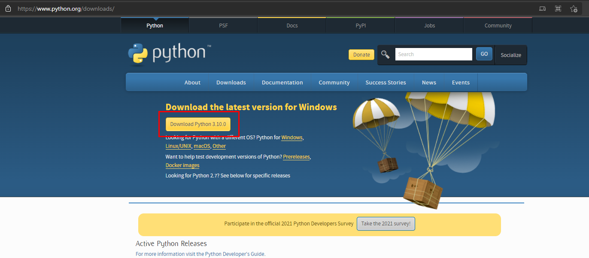
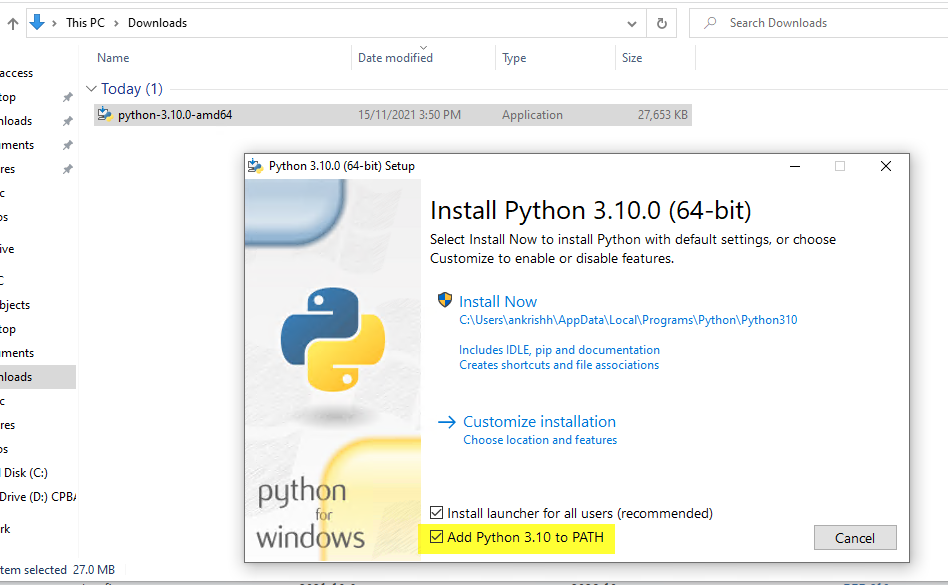
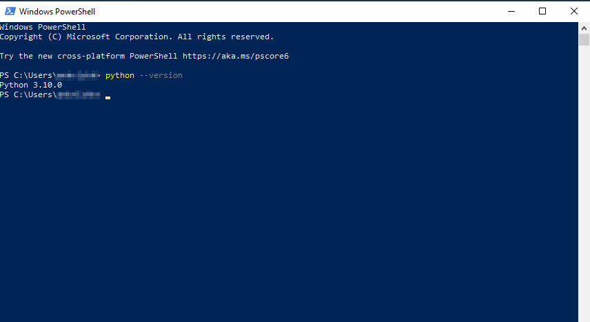
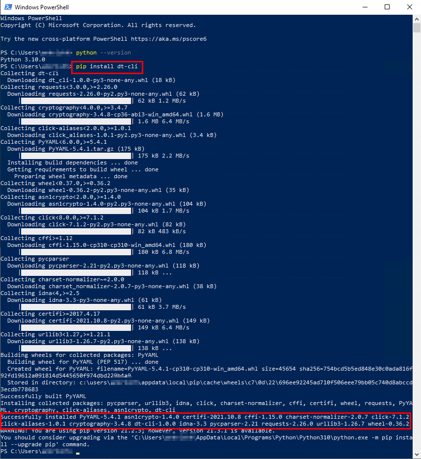
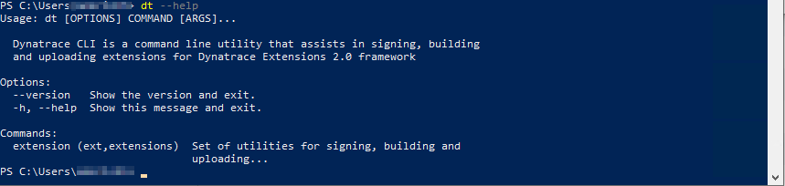
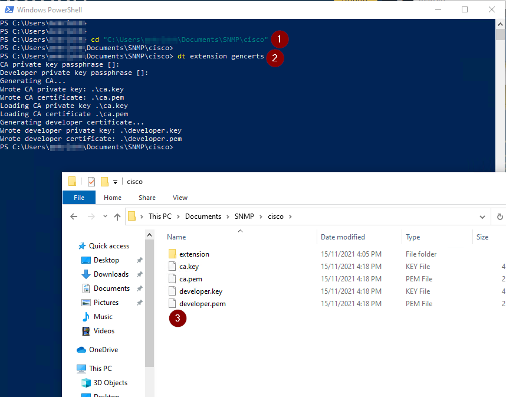
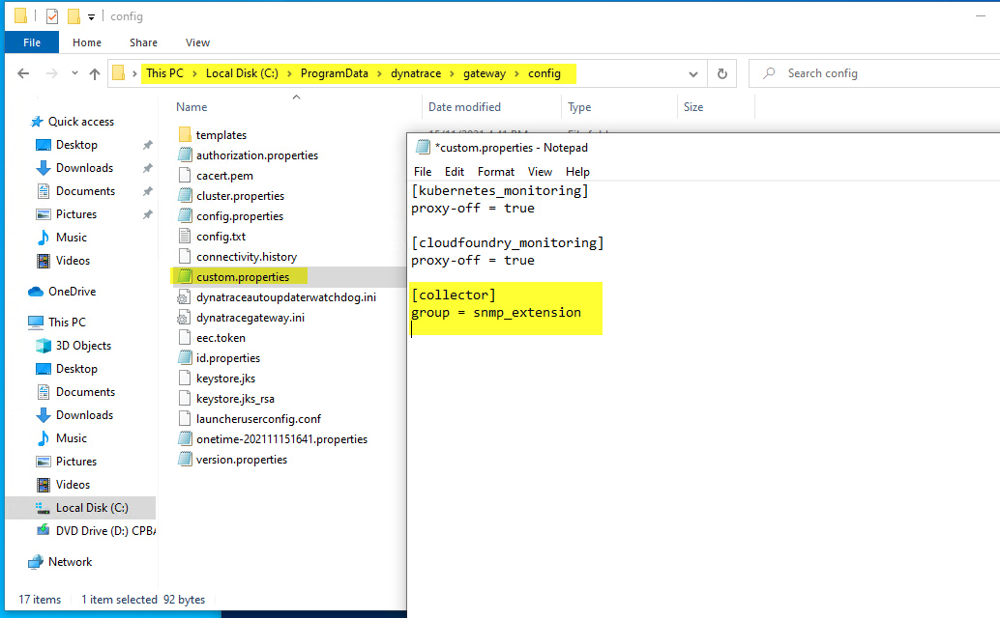
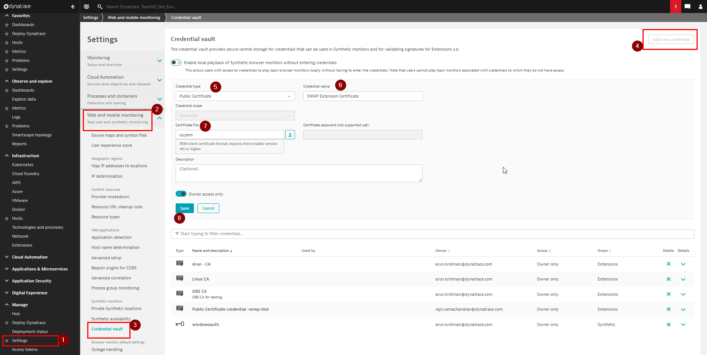

# Sign Extension

The next step in extension creation process is to Sign your extension with your Certificate and make it ready for use.

> NOTE: This page describes generating and signing an extension using Dynatrace Open Source [dt-cli](https://github.com/dynatrace-oss/dt-cli) utility. Please see [Sign extension](https://www.dynatrace.com/support/help/shortlink/sign-extension) official documentation for manual step by step instruction.

<br/>

## Python install

`dt-cli` is a Python utility and therefore requires Python installed on your computer before you can use it.

> This document describes Python installation on Windows OS but steps are similar for other Operating Systems.

1. [Download Python - v3.9+](https://www.python.org/downloads/)
   
   Dowload Python v3.9+ from [Python official Downloads page](https://www.python.org/downloads/)

   

2. Install Python

    Open downloaded `.exe` file and select 'Add Python 3.10 to PATH' checkbox and then click `Install Now`

    

    Wait for the installation to complete successfully and click close.

    

3. Open a PowerShell.exe terminal and confirm installation successful.

    

<br/>

## dt-cli install

1. From your PowerShell terminal run `pip install dt-cli`. This will download the `dt-cli` utility onto your computer.

    

2. Confirm success by running `dt --help`

    

<br/>

## Generate certficates and sign extension

Change terminal directory to your directory that has the extension folder and run `dt extension gencerts`. Leave all entries blank by hitting 'Enter' key. 

This generates the CA and Developer Certificates and Keys required to sign the extension.



<br/>

Next sign extension by running `dt extension build`. This command uses the generated certificates to sign the extension and generate a zip file.

<br/>

## Upload `ca.pem` to ActiveGates

The CA certificate used to sign an extension has to be present on all ActiveGates from which the extension is to run. 

If there are multiple ActiveGates in a tenancy, Dynatrace chooses an ActiveGate to run extension based on the ActiveGate group specified in Monitoring configuration (we will be looking at this later)

Copy `ca.pem` file to following ActiveGate directories on respective OS.

Windows: `%PROGRAMDATA%\dynatrace\oneagent\agent\config\certificates\`

Linux: `/var/lib/dynatrace/oneagent/agent/config/certificates`

<br/>

## Assign a group to your ActiveGate

During SNMP monitoring setup, there is the option to select Group of ActiveGates from which extension is to run.

All ActiveGates out of the box belong to 'default' group.

If you would like extension to run from only certain ActiveGates,  specify a new 'group' in those ActiveGate `custom.properties` file and restart Dynatrace ActiveGate service.

Location of custom.properties file:

Windows: `%PROGRAMDATA%\dynatrace\gateway\config\custom.properties`

Linux: `/var/lib/dynatrace/gateway/config/custom.properties`

<br/>

Content to add in `custom.properties`:

```
[collector]
group = snmp_extension
```



Once the ActiveGate service is restarted, the new group name should appear in UI.


<br/>

## Upload `ca.pem` to Dynatrace Tenancy

`ca.pem` file has to be uploaded to tenancy as well. This is for Dynatrace to verify the integrity of extensions that are uploaded.

Navigate to `Settings > Web and mobile monitoring > Credential vault` and click `Add new credential`.




<br/>

### NEXT: [Upload Extension and Setup Monitoring](2_Prepare_extension_file.md)