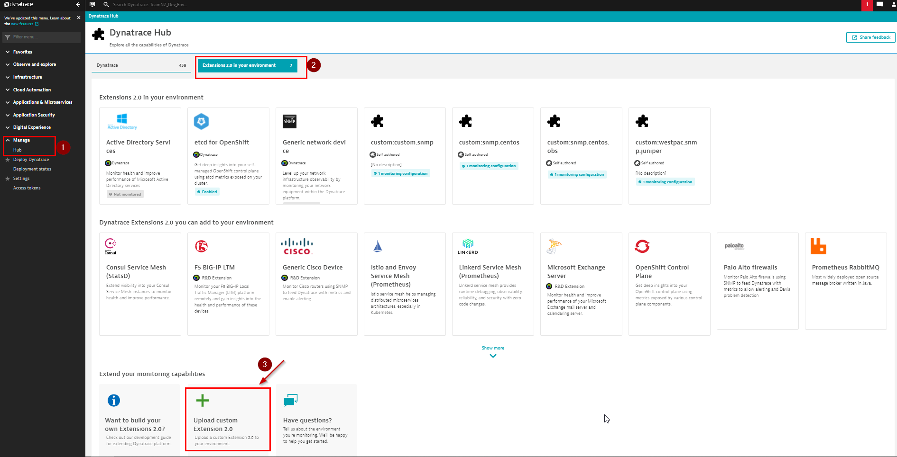
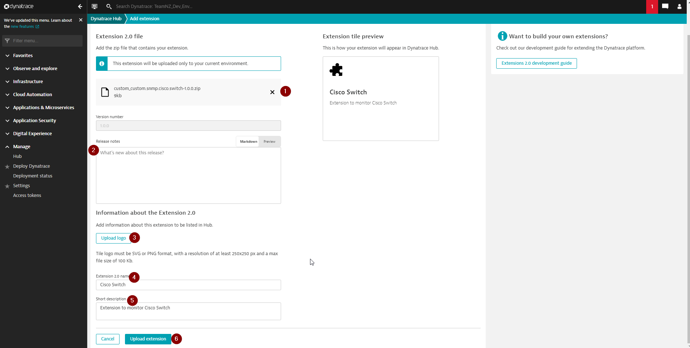
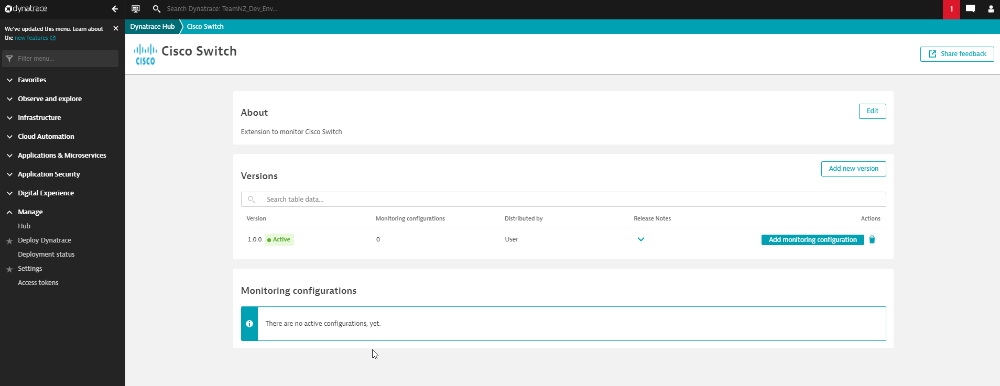
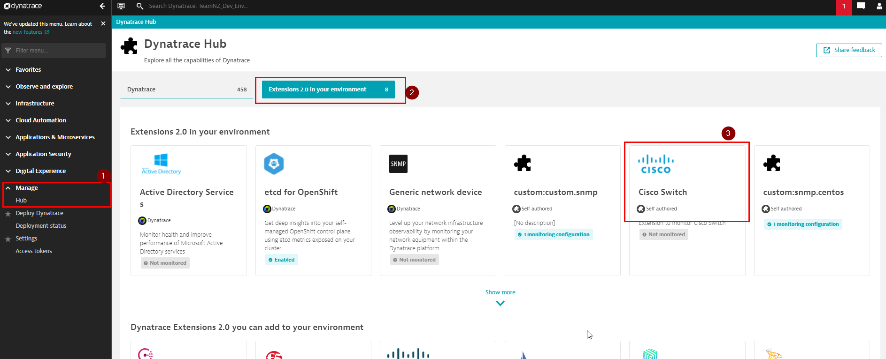
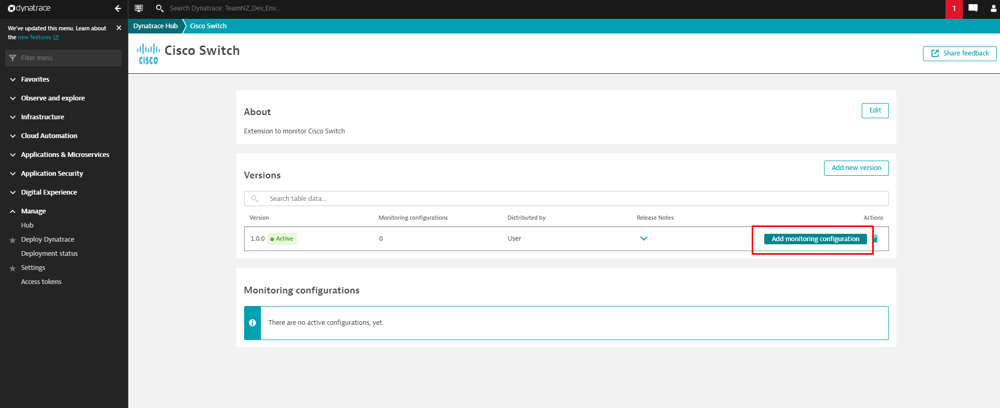
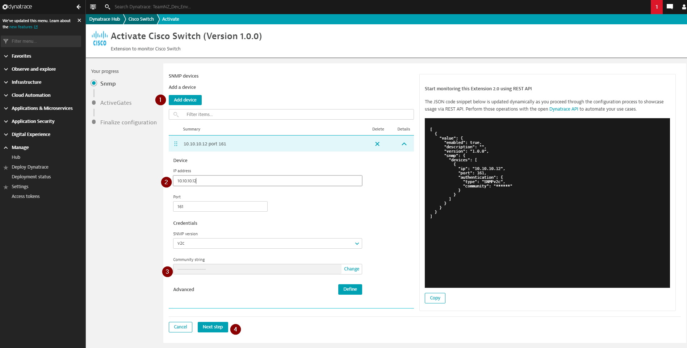
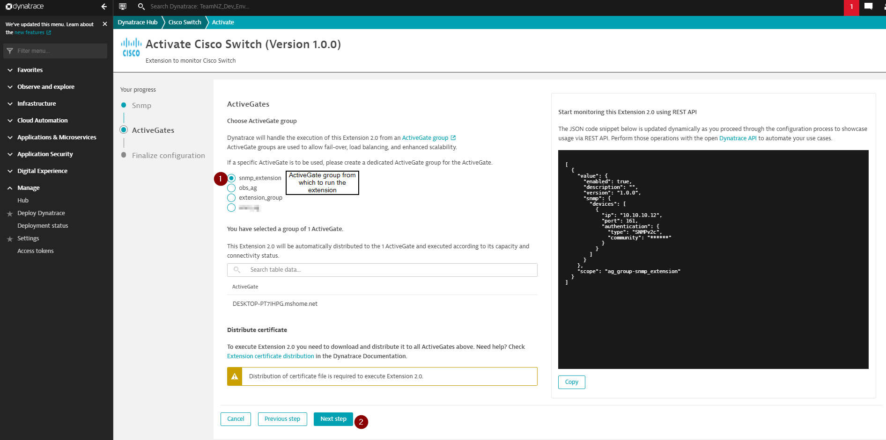
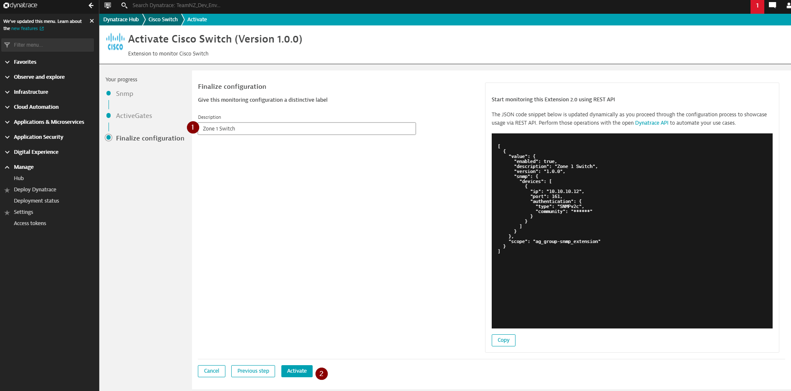
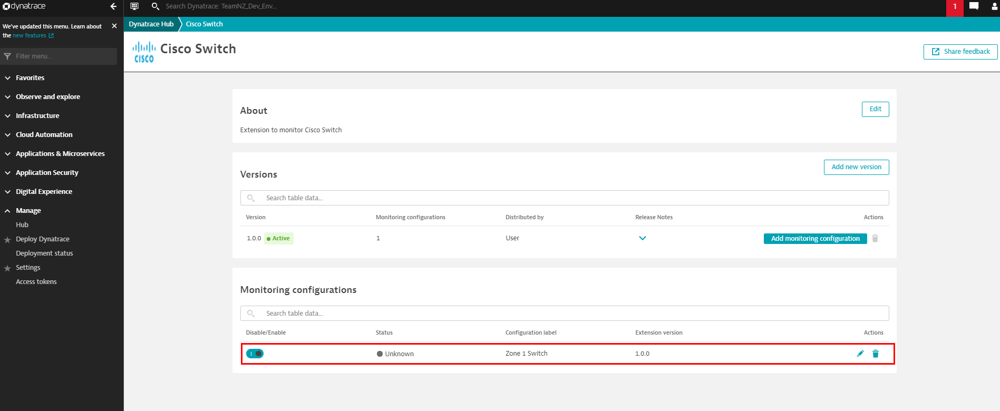

# Upload extension to tenancy and setup monitoring

Extension upload and monitoring configuration setup can be done via both UI and API. This document covers the UI method. If you are interested in doing these through API please refer to [Manage Extension 2.0 lifecycle](https://www.dynatrace.com/support/help/shortlink/extension-lifecycle)

## Upload extension

Navigate to `Manage > Hub > Extension 2.0 in your environment` and then click on `Upload custom Extesion 2.0` 

 

Upload your extension to the page with relevant details

 

Upload extension takes you to the configuration page.

 

## Configure extension endpoints

You get to the configuration page right after you upload the extension or by navigating to `Manage > Hub > Extension 2.0 in your environment > Your extension`

 

Once on configuration page, follow below steps providing relevant details on each page.

 

Once saved the configuration should show as active.

 

Add more monitoring configuration/devices as required.

 

### NEXT: [Check metrics and chart](5_Check_metrics_and_chart.md)
