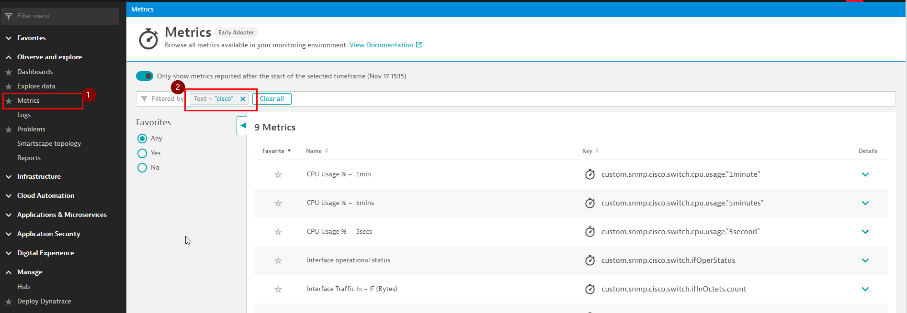
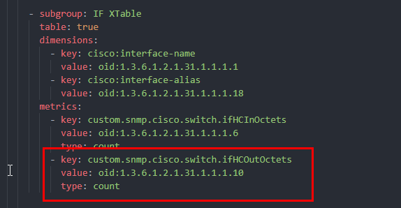
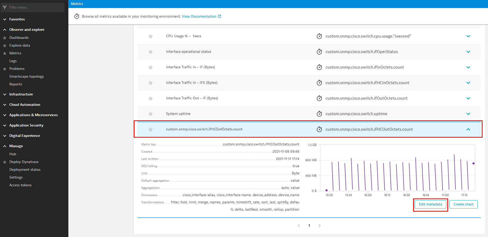
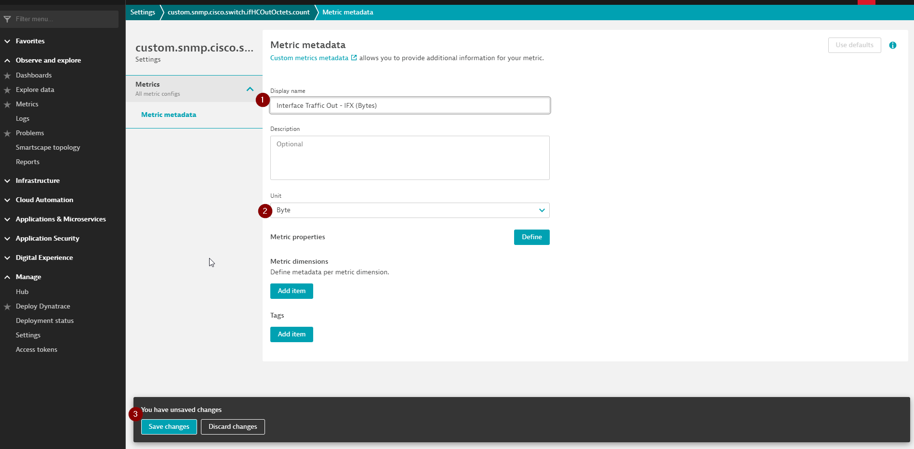
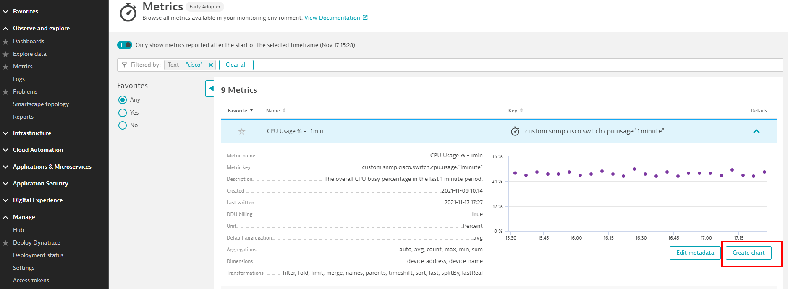
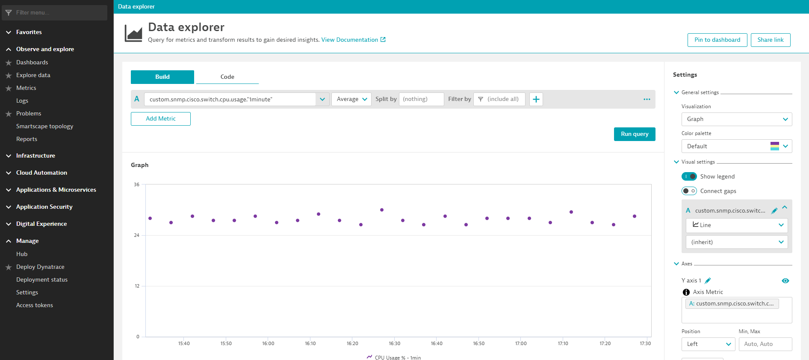

# Check metrics and chart

Once the extension endpoint monitoring is successful, your metrics will start appearing under `Metrics` view in UI. You can focus on just your metrics by filtering with metric key name.

> Please note this can take upto 5 minutes to appear.

 

## Metadata for 'count' metrics

You will notice that metrics for which you had defined 'type: count' (i.e Counter metrics) don't show the metadata you had defined in the extension. Instead, they just show up with the full key name. 

This is a know issue and can be fixed by manually editing the metadata for the metric as below.

 

## Chart metrics

From this point all metrics can be charted as usual using Dynatrace Data Explorer.

 

## NEXT: [Troubleshooting](6_Troubleshooting.md)
