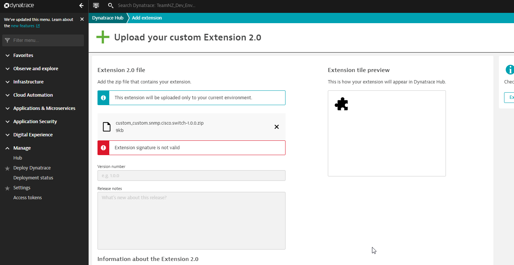

# Troubleshooting

1. Issues during upload

    Fix: Upload `ca.pem` certificate to tenancy

    

2. Metrics don't show after endpoints are setup

    Reason: SNMP Poll to device is not running as expected. 

    Fix: Check logs at below location to learn more (On ActiveGates in Extension group)

    Windows: `%PROGRAMDATA%\dynatrace\remotepluginmodule\log\extensions`

    Linux: `/var/lib/dynatrace/remotepluginmodule/log/extensions`

 

For more details refer to [Extensions 2.0 official documentation](https://www.dynatrace.com/support/help/shortlink/extensions20)

